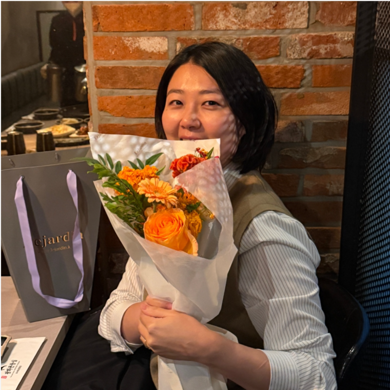
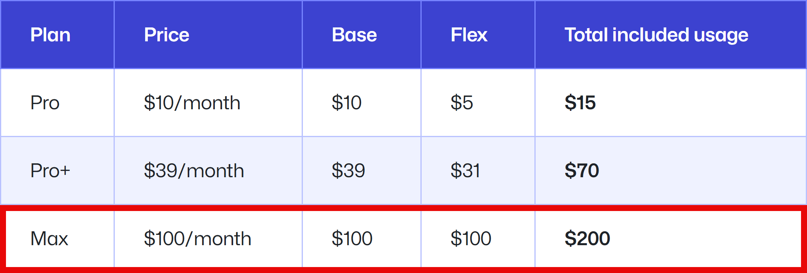
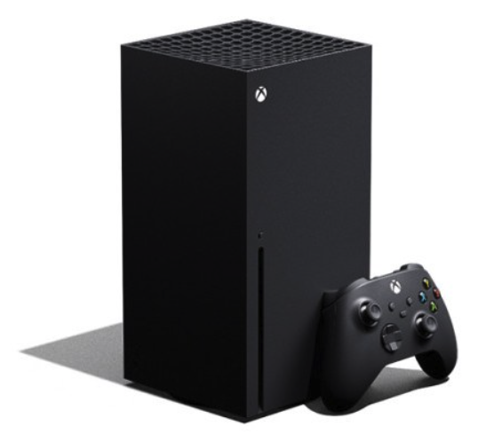
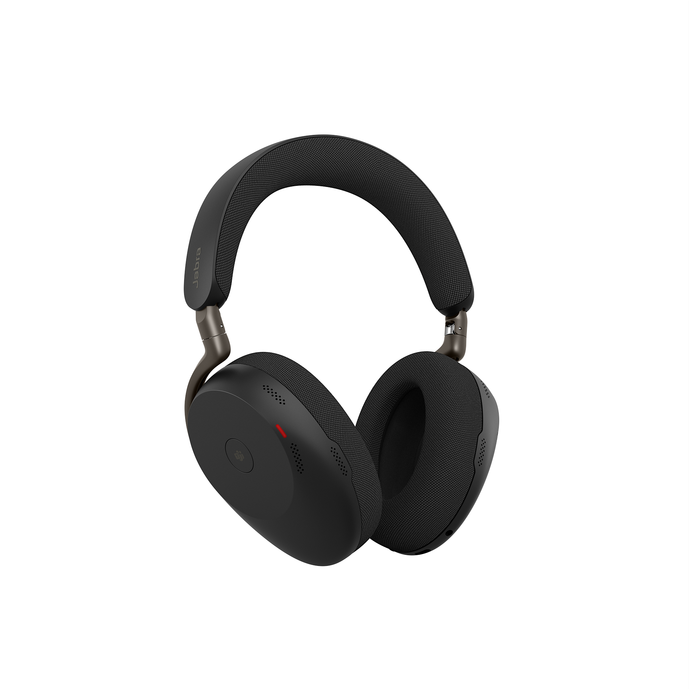
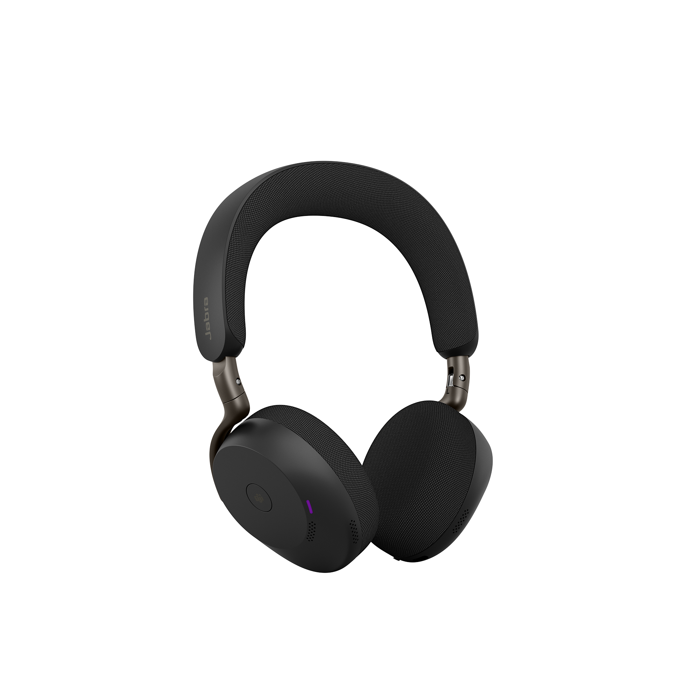
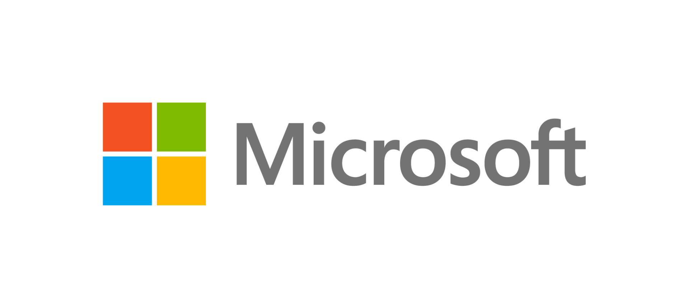
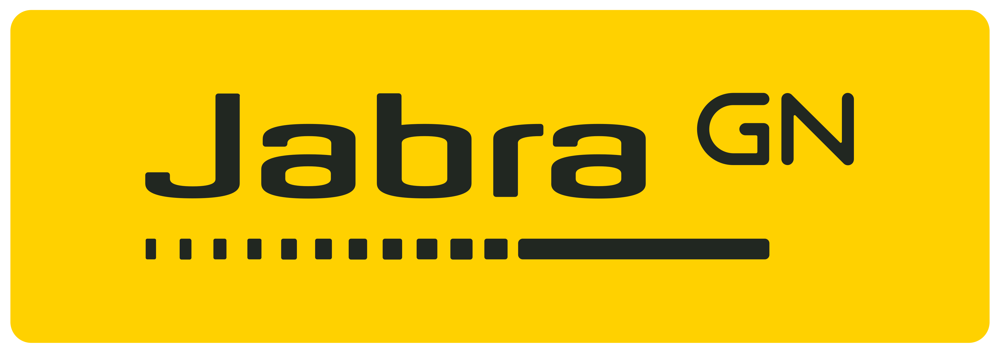
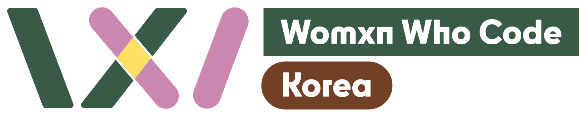

# 천하제일 입코딩 대회

---

천하제일 입코딩 대회 with GitHub Copilot

**GitHub Copilot의 보이스 코딩 기능으로 앱을 만들어 봅시다**

- 📅 2026년 6월 20일 (토)
- 🕐 09:00 - 18:00
- 📍 서울 광화문 마이크로소프트 13층

---

GitHub Copilot의 최신 기능을 활용해서 앱을 개발해 보고 싶은 개발자 및 비개발자를 대상으로 VS Code, Copilot CLI, GitHub App의 음성 코딩 기능만으로 애플리케이션을 개발하는 해커톤입니다.

---

## 키노트 스피커

이희진 | Senior Solutions Engineer | GitHub

---

## 시간 계획

- 09:00 - 09:30: 체크인
- 09:30 - 09:40: 오프닝
- 09:40 - 10:20: 키노트
- 10:20 - 10:30: 주제 소개
- 10:30 - 17:00: 입코딩 해커톤
- 17:00 - 17:30: 발표
- 17:30 - 18:00: 시상 및 클로징

---

## 참가자를 위한 특별한 혜택

천하제일 입코딩 대회에 참석하는 모든 참석자를 대상으로 GitHub Copilot Max 한달 이용권을 무료로 드립니다.

이에 더해 천하제일 입코딩 대회에서만 받을 수 있는 특별한 기념품을 제공합니다.

---

## 입상자 상품

- 대상: 1명 또는 1팀
  - Xbox Series X
  - 
- 최우수상: 1명 또는 1팀
  - Jabra Evolve3 85
  - 
- 우수상: 1명 또는 1팀
  - Jabra Evolve3 75
  - 

위 입상자 상품에 더해 입상자 중 메가존 클라우드에서 선정하여 1500만원 상당의 제품화 컨설팅을 제공합니다.

---

## 행사 후원 및 지원

천하제일 입코딩 대회의 성공적인 개최를 위해 도와주시는 곳입니다.

---

## 참가 신청

- 등록 링크: https://ticketa.co/checkout/entry?ticketId=242

## 기타 안내

- **행사 장소**: 서울 종로구 종로 1길 50, 더케이트윈타워 A동 13층, 한국마이크로소프트
- **참가 대상**: 학생, 개발자, AI 코딩에 관심 있는 누구나. 초보자부터 숙련된 개발자까지 모두 환영합니다
- **주차 지원**: 주차는 지원하지 않습니다. 대중교통을 이용해 주세요
- **행사 문의**: [https://lipcoding.kr/discussion](https://lipcoding.kr/discussions)
